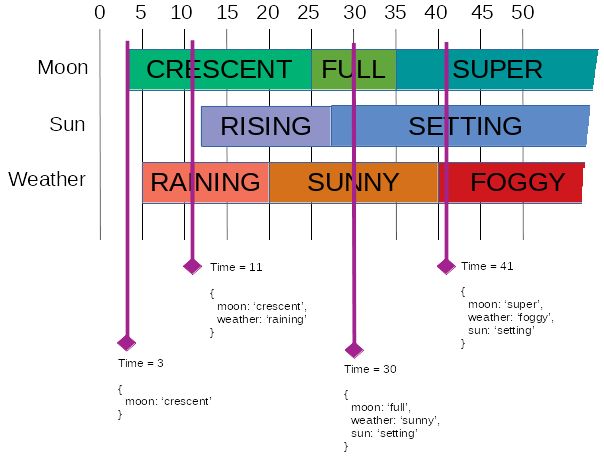

# temporalstate [](https://travis-ci.org/mwri/temporalstate) [](https://coveralls.io/github/mwri/temporalstate?branch=master)

## Quick start

Temporal state is a library for building, manipulating and deriving the
state of a collection of variables over time. It is efficient, using
binary trees, and will scale to big data sets.

For example, if you create a temporalstate object and tell it the **weather**
is `"raining"` at **t = 5** it can then be derived that the **weather** is
`null` from the start of time until **t = 5**, and from then until the end
of time it is `"raining"`. You can derive the value for **weather** at any
time in fact.

If you also add that the **moon** is `"crescent"` at **t = 3** and introduce
data concerning any number of other variables, then the full set of all variable
values can be derived for any given time.

The value of any variable before the time of its first value will be
`null`, and the chronologically last value of a variable will persist forever.

Take this example time line, with three variables, weather, moon and sun:



Building up this state would be done as follows:

```javascript
import temporalstate from 'temporalstate';

let db = new temporalstate();

db.add_change('weather', 'raining', 5);
db.add_change('weather', 'sunny', 20);
db.add_change('weather', 'foggy', 40);
db.add_change('moon', 'crescent', 3);
db.add_change('moon', 'full', 25);
db.add_change('moon', 'super', 35);
db.add_change('sun', 'rising', 12);
db.add_change('sun', 'setting', 27);
```

It doesn't matter what order the state changes are added, the state of the
whole thing will always reflect the changes that have been entered in so far.

The state of a single variable at any time can be queried by calling `state()`
with two arguments:

```javascript
db.state(0, 'moon') == null
db.state(2, 'moon') == null
db.state(3, 'moon') == 'crescent'
db.state(19, 'moon') == 'crescent'
db.state(20, 'moon') == 'crescent'
db.state(34, 'moon') == 'full'
db.state(35, 'moon') == 'super'
db.state(40, 'moon') == 'super'
db.state(9999, 'moon') == 'super'
```

The state of all variables at any time can be queried by calling `state()`
with a single argument:

```javascript
db.state(0) == {}
db.state(10) == { weather: 'raining', moon: 'crescent' }
db.state(20) == { weather: 'sunny', moon: 'crescent', sun: 'rising' }
db.state(30) == { weather: 'sunny', moon: 'full', sun: 'setting' }
db.state(40) == { weather: 'foggy', moon: 'super', sun: 'setting' }
db.state(999999) == { weather: 'foggy', moon: 'super', sun: 'setting' }
```

You can also regurgitate all the changes which constitute the current
all time state by calling `change_list()`:

```javascript
db.change_list() === [
  { timestamp: 3, name: 'moon', val: 'crescent' },
  { timestamp: 5, name: 'weather', val: 'raining' },
  { timestamp: 12, name: 'sun', val: 'rising' },
  { timestamp: 20, name: 'weather', val: 'sunny' },
  { timestamp: 25, name: 'moon', val: 'full' },
  { timestamp: 27, name: 'sun', val: 'setting' },
  { timestamp: 35, name: 'moon', val: 'super' },
  { timestamp: 40, name: 'weather', val: 'foggy' } ]
]
```

Note that this data is parsimonious, no valueless data is kept, so if
you add a change to the effect that it is raining at time 5, this will
not change the change list or any other derivation at all. Similarly
if it is raining at 5, sunny at 10 and raining again at 15, if you
then say it is raining at 10 the number of changes is optimised down
to just the one rainining at 5 record.

The **time** is given as an integer in the examples above, but a **Date**
object, a **float** or a **string** can be used instead. Anything that
can be compared with the less than and greater than comparison operators
will work.

## Contents

1. [Quick start](#quick-start).
   1. [Contents](#contents).
   2. [Full API reference](#full-api-reference).
      1. [Functions](#functions).
         1. [constructor](#constructor).
         2. [add_change](#add_change).
         3. [remove_change](#remove_change).
         4. [change_list](#change_list).
         5. [var_list](#var_list).
         6. [first](#first).
         7. [last](#last).
         8. [next](#next).
         9. [prev](#prev).
         10. [at](#at).
         11. [after](#after).
         12. [before](#before).
         13. [state](#state).
         14. [state_detail](#state_detail).
         15. [change_cmp](#change_cmp).
      2. [Events](#events).
         1. [new_var](#new_var).
         2. [add](#add).
         3. [rm](#rm).
         4. [change](#change).
         5. [txn](#txn).
2. [Build](#build).

## Full API reference

Import the `temporalstate` constructor with import:

```javascript
import temporalstate from 'temporalstate';
```

Or with require:

```javascript
let temporalstate = require('temporalstate').default;
```

### Functions

#### constructor

Constructs a `temporalstate` object.

```javascript
let db = new temporalstate();
```

#### add_change

Adds a change to the temporal data. If the change is redundant
or renders other current changes redundant they will be trimmed
so that the data is always kept parsimonious.

Three parameters are given, respectively the state name, the
state value, and the time when the state of the given name
becomes that value.

```javascript
db.add_change('weather', 'sunny', 20);
db.add_change('weather', 'foggy', 40);
db.add_change('moon', 'crescent', 3);
```

#### remove_change

Removes a change. The call will have no affect if the change does not
exist.

```javascript
db.remove_change({'timestamp': 20, 'name': 'weather', 'val': 'sunny'});
```

#### change_list

Returns the set of all known changes.

```javascript
let changes = db.change_list();
```

Here, `changes` will be a list of objects, each with `timestamp`,
`name` and a `val` keys, for example like this:

```javascript
[
  { timestamp: 3,  name: 'moon',    val: 'crescent' },
  { timestamp: 5,  name: 'weather', val: 'raining'  },
  { timestamp: 12, name: 'sun',     val: 'rising'   },
  { timestamp: 20, name: 'weather', val: 'sunny'    },
  { timestamp: 25, name: 'moon',    val: 'full'     },
  { timestamp: 27, name: 'sun',     val: 'setting'  },
  { timestamp: 35, name: 'moon',    val: 'super'    },
  { timestamp: 40, name: 'weather', val: 'foggy'    },
]
```

#### var_list

Returns a list of known variables. This will include variables
without states, if there are any. The result is sorted.

```javascript
let vars = db.var_list();
```

Here, `vars` will be a list of variable names, like this:

```javascript
[
  'moon',
  'sun',
  'weather',
]
```

#### first

Returns the first change(s) (i.e. the first ranked by time).
The return value is a list, and will contain all the changes
which have a time equal to the lowest time in the database.
So this will probably usually be a list of one change, but
could be any number. The return value can also be `null` if
there are no changes in the database.

```javascript
let first_changes = db.first();
```

Here, `first_changes` will be a list of objects just like those
returned by [change_list](#change_list) above:

```javascript
[ { timestamp: 3, name: 'moon', val: 'crescent' } ]
```

Or it could be:

```javascript
[
  { timestamp: 3, name: 'moon',        val:  'crescent' },
  { timestamp: 3, name: 'temperature', val:  22         },
]
```

The time will always be the same if there are multiple
changes.

#### last

This is like [first](#first) but it returns the last change(s).
Again there can be multiple changes if their time is the same
and again the return value can instead be `null` if there are
no changes in the database.

```javascript
let last_changes = db.last();
```

Here, `last_changes` will be a list of objects just like those
returned by [change_list](#change_list) and [first](#first)
above:

```javascript
[ { timestamp: 40, name: 'weather', val: 'foggy' } ]
```

Or it could be:

```javascript
[
  { timestamp: 40, name: 'temperature', val: 18      },
  { timestamp: 40, name: 'weather',     val: 'foggy' },
]
```

#### next

This returns the next change (after the one passed as an
argument). Much like [first](#first) and [last](#last),
multiple changes may be returned if they are of the same
time.

```javascript
let next_changes = db.next({timestamp: 20, name: 'weather', val: 'sunny'});
```

Here, `next_changes` will be a list of objects, like:

```javascript
[ { timestamp: 25, name: 'moon', val: 'full' } ]
```

Or it could be:

```javascript
[
  { timestamp: 25, name: 'moon',        val: 'full' },
  { timestamp: 25, name: 'temperature', val: 25     },
]
```

#### prev

This returns the previous change (after the one passed as an
argument). Much like [prev](#prev) multiple changes may be
returned if they are of the same time.

```javascript
let prev_changes = db.prev({timestamp: 20, name: 'weather', val: 'sunny'});
```

Here, `next_changes` will be a list of objects, like:

```javascript
[ { timestamp: 12, name: 'sun', val: 'rising' },
```

Or it could be:

```javascript
[
  { timestamp: 12, name: 'sun',         val: 'rising' },
  { timestamp: 12, name: 'temperature', val: 14       },
]
```

#### at

Returns the change(s) occurring at exactly the specified time.
The required time is passed as an argument. Because multiple
changes (of different variables) could match the return value
is an array. For example:

```javascript
let changes_at = db.at(10);
```

Returns an empty list if there are no changes at the specified
time.

#### after

Returns the change(s) occurring closest after the specified time.
The required time is passed as an argument. Because multiple
changes (of different variables) could match (if they share the
closest time) the return value is an array. For example:

```javascript
let changes_after = db.after(20);
```

If the time specified is after the last known change, then
`null` is returned.

#### before

Returns the change(s) occurring closest before the specified time.
The required time is passed as an argument. Because multiple
changes (of different variables) could match (if they share the
closest time) the return value is an array. For example:

```javascript
let changes_before = db.before(20);
```

If the time specified is before the first known change, then
`null` is returned.

#### state

Returns the state at any given time. Takes either one or two
arguments, the first, compulsory parameter, is the time, and
the second is the name of a state. If no state name is given
then all states that have a value at the given time will be
returned as an object, with the keys being state names and
the values being the state values. Where a state name is
given the return value will be the states value, or null if
it does not have a value at that time.

With a single argument:

```javascript
all_states_at_20_time = db.state(20);
```

Here `all_states_at_20_time` will contain something like this:

```javascript
{ weather: 'sunny', moon: 'crescent', sun: 'rising' }
```

With a second argument:

```javascript
weather_at_20_time = db.state(20, 'weather');
```

Here `weather_at_20_time` will contain something like this:

```javascript
'sunny'
```

#### state_detail

State detail, like [state](#state) takes one or two arguments, the
time, and optionally a state name. It also similarly returns state
data, but instead of just the state values at the specified time
it returns data concerning when the state became that value (which
will be at or before the time passed as argument one) and data
concerning when it ceases to be that value (which will be after
the time passed as argument one) and what the next value is.

The return value when a second argument (state name) is passed
is of the form `{'from': current_change, 'to': next_change}`, where
`current_change` and `next_change` are formatted like the
changes returned by [change_list](#change_list), something like
`{ timestamp: 3, name: 'moon', val: 'crescent' }`.

```javascript
let weather_details_at_20_time = db.state_detail(20, 'weather');
```

The value of `weather_details_at_20_time` would now be something
like:

```javascript
{
  from: { timestamp: 20, name: 'weather', val: 'sunny' },
  to:   { timestamp: 40, name: 'weather', val: 'foggy' },
}
```

The return value when only a single argument (the time) is passed
is a list of such from to structures.

In all cases, where the time given is before the first value of a
state, `null` is the `to` value, and where the time given is after
the last change (or equal in time to it), `null` is the `from`
value. Where no data exists for a state name the return value or
the state name is unknown, then `null` is returned instead of
`{'from': null, 'to': null}`, for that state.

```javascript
let all_states_at_30_time = db.state_detail(30);
```

The value of `all_states_at_30_time` would now be something
like:

```javascript
[
  { from: { timestamp: 25, name: 'moon', val: 'full' },
    to:   { timestamp: 35, name: 'moon', val: 'super' },
  },
  {
    from: { timestamp: 27, name: 'sun', val: 'setting' },
    to:   null,
  },
  {
    from: { timestamp: 20, name: 'weather', val: 'sunny' },
    to:   { timestamp: 40, name: 'weather', val: 'foggy' },
  }
]
```

The ordering of the list is done by the state name

#### change_cmp

This is a static function, not a class method, it takes two
arguments and provides the sort order for changes (as returned
by [change_list](#change_list)) by returning 1, 0 or -1, like
all sort element comparison functions.

The order of changes is determined first by the time of the
change, and then by the name of the state.

### Functions

#### new_var

The **new_var** event is emitted when a new variable is realised.
Adding an event with a variable name not seen before will cause
this.

```javascript
db.on('new_var', (name) => {
    console.log('added "'+name+'", not seen before');
});
```

#### add

The **add** event is emitted when a change is added to the database.

```javascript
db.on('add', (change) => {
    console.log('added a change (at '+change.timestamp+' '+change.name+' = '+change.val)');
});
```

Note that this event will only fire for an actual change, so if
a change is added that is redundant, no event will occur.

#### rm

The **rm** event is emitted when a change is eliminated from the
database.

```javascript
db.on('add', (change) => {
    console.log('removed a change (at '+change.timestamp+' '+change.name+' = '+change.val)');
});
```

Changes may be removed to preserve the parsimony of the database so
the change removal need not be explicit.

#### change

The **change** event is emitted when a change is made that alters the
value of an existing variable at a time when that variable already
has a change.

```javascript
db.on('change', (prev, new_val) => {
    console.log('change '+prev.name+' = '+prev.val at '+prev.timestamp+' changing to '+new_val);
});
```

#### txn

The **txn** event is emitted when any change occurs. A change may
result in multiple operations however (and hence as a result a
number of **add**, **rm** or **change** events may be emitted)
so if it is desired to either capture these as one transaction
or to capture the original change that caused them, the **txn**
transaction should be used.

```javascript
db.on('txn', (change, ops) => {
    console.log('change requested:');
    console.log(change);
    console.log('operations required:');
    console.log(ops);
});
```

For example, if the following changes are added (to an empty
database):

```javascript
db.add_change('weather', 'raining', 10);
db.add_change('weather', 'sunny', 20);
db.add_change('weather', 'raining', 30);
```

Then this change is added:

```javascript
db.add_change('weather', 'raining', 20);
```

The **txn** event will be emitted with the first argument being
`{'add': {'timestamp': 20, 'name': 'weather', 'val': 'raining'}}`
and the second being `[{'remove': {'timestamp': 20, 'name': 'weather',
'val': 'sunny'}}, {'remove': {'timestamp': 30, 'name': 'weather',
'val': 'raining'}}]`.

Most changes will of course usually result in a transaction with
a single operation which is identical to the actual change requested.

If a change is due to a `remove_change` call instead of a `add_change`
then there can only be one operation, but in addition to the **rm**
event, a **txn** even is also emitted. In the case of the following
removal for example:

```javascript
db.remove_change('weather', 'raining', 20);
```

...the **txn** event will be emitted with the first argument being
`{'remove': {'timestamp': 20, 'name': 'weather', 'val': 'raining'}}`
and the second being `[{'remove': {'timestamp': 20, 'name': 'weather',
'val': 'sunny'}}, {'remove': {'timestamp': 30, 'name': 'weather',
'val': 'raining'}}]`.

## Build

run `npm install` to install the dependencies, and `grunt build` to
build (or `./node_modules/.bin/grunt build` if you do not have
grunt, grunt CLI locally installed.

This will run code checkers and linters and the test suite, report on
coverage and build build `dist/temporalstate_es5.js`, an ES5 babel
transpile of the ES6 source.

Running `grunt watch:build` will watch for changes to the source or
tests and invoke the full build cycle when they are detected. Running
`grunt watch:test` will again watch for changes, and invoke the most
light weight possible file test cycle.

Note that in the event of stack traces being output during the full
build, with coverage reports, the stack trace line numbers will be
broken. Run `test` or `watch:test` for valid stack traces instead
of `build`.
